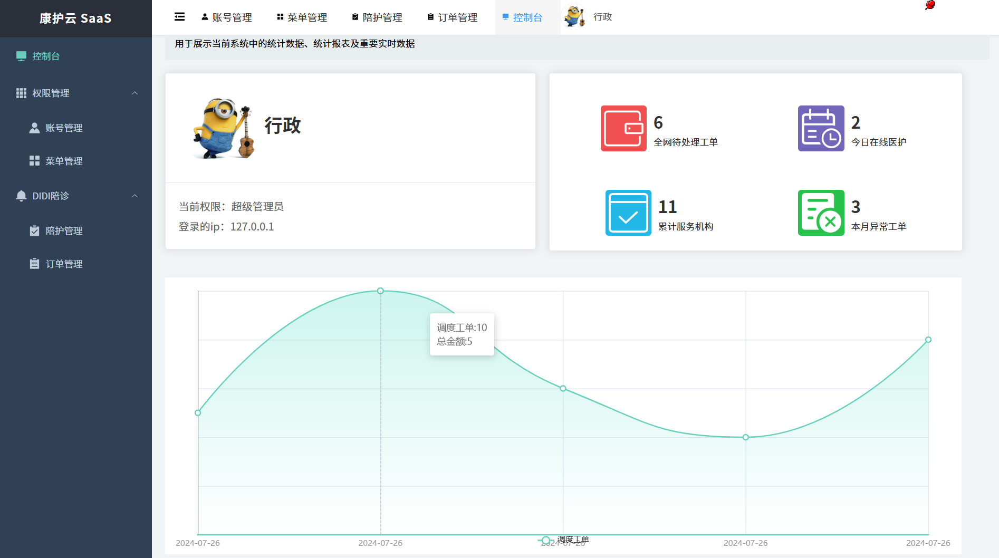

# 康护云 SaaS 数字化管理平台 (Vue3 + TS + Element-Plus)

> **项目简介**：这是一个从陪诊练习逐步重构而来的 SaaS 医疗管理原型。支持多机构调度、动态权限隔离，是我在大二期间深入探索 Vue3 工程化链路的成果。

### 🔗 [点这里在线预览](https://elinnlie.github.io/vue-project/)

## 📸 运行截图

## 🌟 项目核心亮点
* **SaaS 权限架构**：基于 RBAC 模型，通过登录角色动态 `addRoute` 挂载路由，实现了不同机构间的菜单与按钮级权限隔离。
* **导航体系**：自主实现了多标签页（TagsView）导航，并结合 Vuex 状态持久化解决了刷新页面后标签丢失的问题。
* **数据可视化**：利用 Echarts 5.0 封装了工单监控大屏，处理了图表在侧边栏收缩时的响应式重绘逻辑。
* **全量 TS 重构**：目前正在将项目从 JS 架构平稳迁移至 TypeScript，通过定义严格的业务领域模型提升代码健壮性。

## ⚙️ 开发与部署
* **自动化发布**：集成 `gh-pages` 实现了 CI/CD 流程，通过配置 Vite 的 Base 路径解决了生产环境下 404 资源加载问题。
